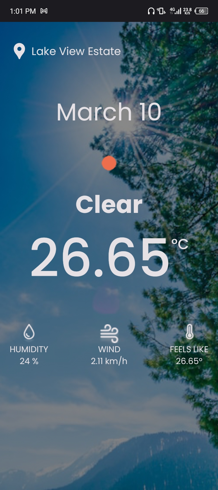
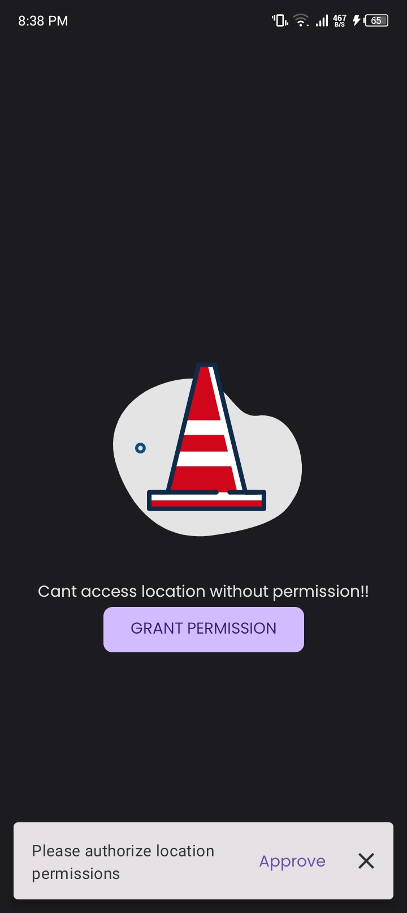

# WeatherSavy

## Overview

WeatherSavy is a comprehensive weather application designed to provide users with accurate and up-to-date weather conditions and forecasts based on their location.

## Setup
Obtain your key from [OPEN WEATHER API](https://openweathermap.org/api) and replace it in the `local.properties` file.

```groovy
    API_KEY = "YOUR_API_KEY"
```

## Screenshots

<table>
  <tr>
    <th>Home Screen</th>
    <th>Loading Screen</th>
    <th>Permission denied Screen</th>
  </tr>
  <tr>
    <td></td>
    <td></td>
    <td></td>
  </tr>
  </table>

## Tech Stack
- The app is entirely written in [Kotlin](https://kotlinlang.org/)
- [Hilt](https://developer.android.com/training/dependency-injection/hilt-android) - Hilt provides a standard way to use DI in your application by providing containers for every Android class in your project and managing their lifecycles automatically.
- [Jetpack Compose](https://developer.android.com/jetpack/compose) - Jetpack Compose is Android’s modern toolkit for building native UI. It simplifies and accelerates UI development on Android. Quickly bring your app to life with less code, powerful tools, and intuitive Kotlin APIs.
- [Coroutines](https://kotlinlang.org/docs/coroutines-overview.html) - A concurrency design pattern that you can use on Android to simplify code that executes asynchronously.
- [Coil](https://coil-kt.github.io/coil/) - An image loading library for Android backed by Kotlin Coroutines.
- [Retrofit](https://square.github.io/retrofit/) - A type-safe REST client for Android and Java which aims to make it easier to consume RESTful web services.
- [Kotlin Flows](https://developer.android.com/kotlin/flow) - Aids in handling streams of data asynchronously which is being executed sequentially.
- [Moshi](https://github.com/square/moshi) - a modern JSON library for Android, Java and Kotlin. It makes it easy to parse JSON into Java and Kotlin classes.
- [Jetpack Datastore](https://developer.android.com/topic/libraries/architecture/datastore) -  A data storage solution that allows you to store key-value pairs or typed objects with protocol buffers.
- [Room](https://developer.android.com/training/data-storage/room) - Room provides an abstraction layer over SQLite to allow for more robust database access while harnessing the full power of SQLite.
- [WorkManager](https://developer.android.com/topic/libraries/architecture/workmanager) - WorkManager is an Android Jetpack library that runs deferrable, guaranteed background work when the work’s constraints are satisfied.
  
<b>NB:</b> The app is still a WIP

##  Contribution
Contributions, issues, and feature requests are welcome!
